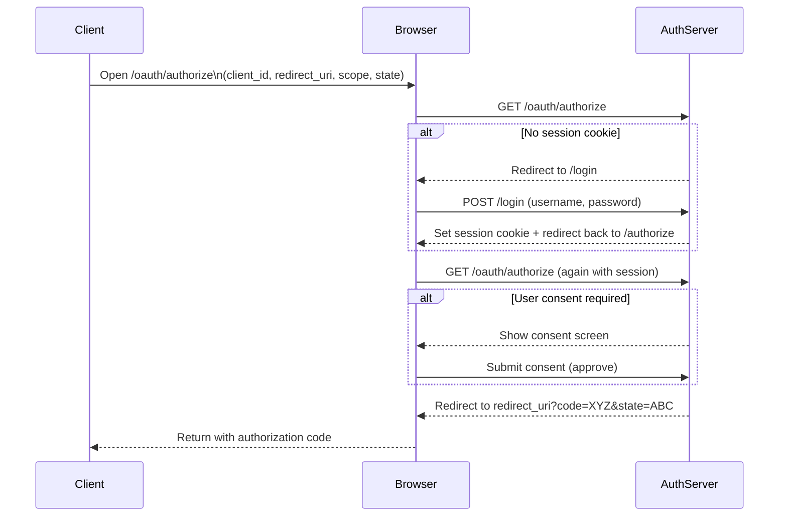

## History

2007 first OAuth 1.0 released

## Use cases

One of them is single sign on for multiple apps

## Request Params for /oauth/authorize

### response_type 

response_type usually is `code` which is a code being returned in case of successful requests. Later that will be exchanged with a token.

## Authorization Server

    * Authenticates users(login)
    * Issues Authorization codes
    * Exchanges them for tokens
    * Validate clients
    * Returns access/id/refresh tokens

## Resource Server

Your APIs

## OAuth vs OpenID Connect

OpenID Connect is a extension to OAuth.

You call first `/oauth/authorize` then you will get a `code` but if you indicate in the call you will need an openid token then:

```
GET /authorize?
  response_type=code
  &client_id=...
  &scope=openid email profile
```

Then you will be able to get from `/oauth/token` id token as well.

```
{
  "access_token": "xyz123",
  "id_token": "jwt_token_here",
  "token_type": "Bearer",
  "expires_in": 3600
}
```

## More Terminology

* Resource Owner: The user
* User Agent: Device
* OAuth Client: The applicaition
* Resource Server: The API

## Sequence Diagram


